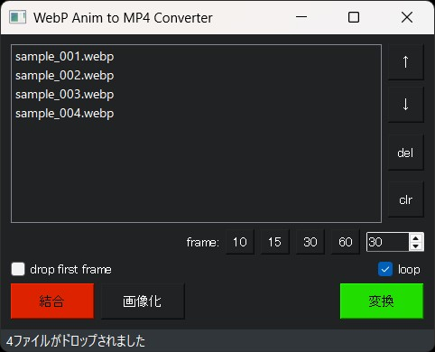
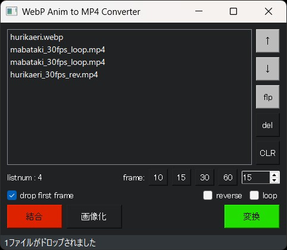

## WebpAnim2Mp4について 0.2.9
WebPのアニメーションファイルをmp4に変換します  
また動画や画像を結合してmp4として出力できます  

## 特徴
- 変換：動画生成AIなどで作成した、短いWebPアニメーションファイルをmp4に手軽に変換
- 変換：フレームの逆再生、ループ指定が可能
- 結合：複数のWebP,mp4,png,jpgファイルを一つのmp4に結合可能
- 結合：ファイルの順序を変更することで簡易な編集も可能
- 画像化：WebP,mp4の全フレームを連番のpng画像として出力が可能（最初と最後のみも可）

## インストール方法（簡易）
[簡易インストール版zipのダウンロード]  
    https://github.com/nekotodance/WebpAnim2Mp4/releases/download/latest/WebpAnim2Mp4.zip  

- Pythonのインストール（SD標準の3.10.6推奨）
- zipファイルを解凍
- 解凍したフォルダ内の「wm-install.ps1」を右クリックして「PowerShellで実行」を選択
> [!WARNING]
> シェルスクリプトはデフォルトでは動作しない設定となっています  
> その場合はターミナルを管理者として実行し、以下のコマンドを実行してください（比較的安全な方式）  
> Set-ExecutionPolicy Unrestricted -Scope CurrentUser -Force

- イントールの最後にデスクトップにリンクをコピーするかどうかを聞いてきます  
「"Do you want to copy the shortcut to your desktop? (y or enter/n)」  
必要があれば「y」入力後、もしくはそのまま「enter」キー  
必要なければ「n」入力後「enter」キー  
- WebpAnim2Mp4リンクが作成されます

## インストール方法（手動）
- Pythonのインストール（SD標準の3.10.6推奨）
- gitのインストール
- gitでリポジトリを取得  
`git clone https://github.com/nekotodance/WebpAnim2Mp4`
- 必要なライブラリ  
`pip install -r requirements.txt`
- 実行方法  
`Python WebpAnim2Mp4.py`

## 利用方法
まずはアプリ上にWebPアニメーションファイルをドラッグ＆ドロップ  
次に以下のいずれかのボタンで処理を行います  

#### ボタンの説明
###### <ins>変換ボタン</ins> - mp4ファイルに変換
- WebP動画のみを対象として処理
- フレームレート、loop[^1]、reverse[^2]の指定を元に処理
- 入力ファイル数分の変換後mp4ファイル[^3]を生成

###### <ins>結合ボタン</ins> - 動画や画像ファイルを結合して1つのmp4ファイルに変換
- WebP、mp4、jpg、pngを「リストの順序通り」に結合処理
- フレームレート、loop[^4]、drop first frame[^5]の指定を元に処理
- 1つのmp4ファイル[^6]を生成

###### <ins>画像化ボタン</ins> - 全てのフレームをPNGファイルとして出力
- WebP、mp4動画のみを対象として処理
- パラメータの指定は参照しません
- 入力ファイル名のフォルダを作成し、全フレームの連番pngファイル[^7]を生成

###### <ins>画像化(最初と最後のみ)ボタン</ins> - 最初と最後のフレームをPNGファイルとして出力
- 基本は画像化ボタンと同様
- 入力ファイル名のフォルダを作成し、最初と最後のフレームの連番pngファイル[^7]を生成

#### リスト操作方法
- 左クリックでファイルを選択、Shift+左クリックで複数選択、Ctrl+左クリックで選択のトグル
- 画面右側の↑、↓ボタンで移動、delボタンで削除、flpボタンで上下入替[^8]、clrボタンで全リスト削除
- キーボードの↑/W、↓/Sキーで移動、delete/BackSpace/Rキーで削除、Fキーで上下入替[^8]、Cキーで全リスト削除

> [!WARNING]
> - 結合する画像と動画の縦横サイズは「必ず」一致させておいてください

> [!TIP]
> - 画像ファイルのみでも結合できるのでGifアニメのようなmp4動画が作成可能
> - 動画ファイルを画像化し選別してから結合することで、出来が悪いフレームの削除が可能
> - 動画ファイルを画像化し選別してから継続アニメーションをi2vで作成し、結合などの後加工が可能

## 注意事項
- ComfyUIで作成したWebPアニメーションファイルでしかテストしていません
- 短いアニメーションファイルをターゲットとしているため、長い動画の処理には向いていません！！
- 当たり前ですが、mp4に変換したあとでpng画像化を繰り返すと徐々に画質が劣化していきます

## サンプル
注意：ここで表示する動画はreadmeで表示出来るようにgifに変換しているため画質が落ちています
- 10fpsのmp4動画に変換  
    docs/sample_001.webpを入力  
    変換ボタンで、docs/sample_001_10fps.mp4を生成  
    
- 30fpsのloopありmp4動画に変換  
    docs/sample_001.webpを入力  
    変換ボタンで、docs/sample_001_30fps_loop.mp4を生成  
    
- 4枚の画像を繰り返してmp4動画に結合  
    docs/sample_001.png - sample_004.pngを3回入力  
    結合ボタンで、docs/sample_001_concati_2fps.mp4を生成  
    指定方法  
    
    

> [!TIP]
> 例えば以下のような使い方が出来ます
> - 振り返るアニメ(hurikaeri)と、その最終フレームからの瞬きをするアニメ(mabataki)の2種類を用意
> - 瞬きをするアニメ(mabataki)をloop指定でmp4変換
> - 振り返るアニメ(hurikaeri)をreverse指定でmp4変換
> - 下記の画像のように、hurikaeri、mabataki_loop、mabataki_loop、hurikaeri_revの順に登録
> - drop first frameのチェックを入れて結合を行う
> - そうすると、振り返って瞬きを2回行い、また向こうを向くアニメーションファイルが出来ます

## 変更履歴
- 0.2.9 最初と最後のフレームのみ出力する機能で変換中の状況表示が行えていなかったのを修正
- 0.2.8 画像化時に処理中のFrame番号を表示する機能を追加
- 0.2.7 画像化に最初と最後のフレームのみ出力する機能を追加
- 0.2.6 サウンドとエラー処理を追加、pipライブラリのバージョンを固定に修正
- 0.2.5 アイコンを追加
- 0.2.4 ボタンの順序と色を変更
- 0.2.3 loop指定時に1フレーム少なくなっていた不具合修正、結合モードでもloop指定を有効、他
- 0.2.2 選択中リストのflip機能を追加、リストのキー操作を常時可能に修正、他
- 0.2.1 reverse機能を追加、画像化の対象にmp4も追加、他
- 0.2.0 画像化と結合機能を一新、他
- 0.1.1 最終フレームの画像化、結合機能を追加、他
- 0.1.0 初版

[^1]:変換時のloopについて  
0,1,2,3の4枚のアニメーションの場合、0,1,2,3,0,1,2,3ではなく、0,1,2,3,3,2,1,0でもなく  
0,1,2,3,2,1の動画を生成します （動画をループ再生した場合にフレームが重複しないようにしています）  

[^2]:reverseについて  
0,1,2,3の4枚のアニメーションの場合、3,2,1,0の動画を生成します  
loopと合わせて指定した場合、3,2,1,0,1,2の動画を生成します  

[^3]:input.webpを入力した場合、ファイル名に設定値を付与します  
・frame:15指定の場合は、input_15fps.mp4  
・frame:60指定、loopありの場合は、input_60fps_loop.mp4  
・frame:30指定、reverseありの場合は、input_30fps_rev.mp4  
・frame:10指定、loop、reverseありの場合は、input_10fps_rev_loop.mp4  

[^4]:結合時のloopについて  
結合時は変換時と異なり、動画ファイル内のフレームではなく登録したリストに対するloop指定となります  
0.jpg, 1.jpg, 2.jpg, 3.jpgとリストに登録した場合  
0.jpg, 1.jpg, 2.jpg, 3.jpg, 3.jpg, 2.jpg, 1.jpg, 0.jpgではなく  
0.jpg, 1.jpg, 2.jpg, 3.jpg, 2.jpg, 1.jpgの動画として出力します  

[^5]:drop first frameについて  
a0,a1,a2,a3とb0,b1,b2,b3,b4,b5の二つのアニメーションファイルの場合  
チェックなしで、a0,a1,a2,a3,b0,b1,b2,b3,b4,b5 （全てのフレームを結合）  
チェックありで、a0,a1,a2,a3,b1,b2,b3,b4,b5 （２ファイル目以降の先頭フレームを削除）  
の出力を行います  
これはa3フレームを起点として生成した別のアニメーションファイルを結合することを想定しています  

[^6]:input01.webp、input02.webpを入力した場合、「リスト先頭のファイル名」に設定値を付与します  
・frame:15指定の場合は、input01_concati_15fps.mp4  
・frame:60指定、dropありの場合は、input01_concati_60fps_drop.mp4  
・frame:30指定、loopありの場合は、input01_concati_30fps_loop.mp4  
・frame:10指定、drop、loopありの場合は、input01_concati_10fps_drop_loop.mp4  

[^7]:input.webpを入力した場合、以下のように出力します  
・input_webp_picsフォルダを作成  
・全フレームをinput_frameXXX.pngのような連番ファイルとして出力  
・フレーム数が3桁未満の場合は3桁のゼロパディング、4桁以降はその桁数でゼロパディング

[^8]:上下入替機能の動作  
0,1,<2,3,4,5,6>,7,8のように2,3,4,5,6を選択中に上下入れ替えを実施すると  
0,1,<6,5,4,3,2>,7,8となります  
特定の画像をまとめてドロップして後半部分を逆再生させるような場合に便利に使えます  
